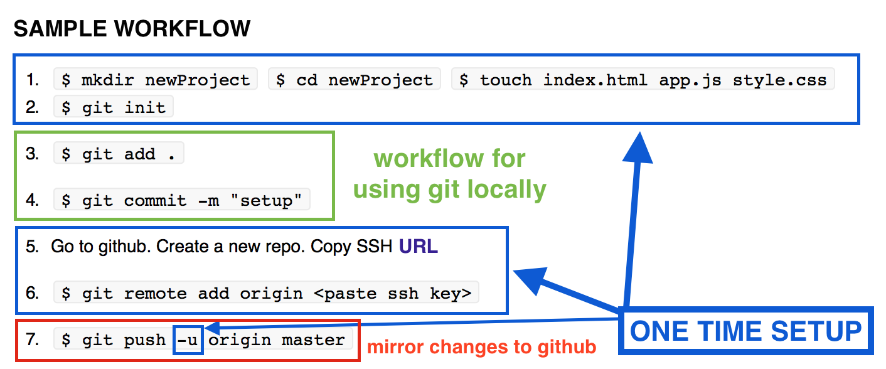

##Intro to Git + Github

###Objectives:

1. Understand Git and Github:
	* What does everybody know so far? (Git v Github)
	* Distributed Version Control System
	* Google Docs example

	
2. Using the class repo
	* Download ZIP / or viewing files from github.com
	* Forking + Cloning
	* HTTPS v SSH
	* "Head over to the class repo and do a git pull"
	
	
3. Create your first git-controlled project
	* Init
	* Status
	* Add 
	* Commit
	* Push	
	
	


---

## 1 Understand Git and Github:

* What does everybody know so far? (Git v Github)

	**TASK** Pair up and explain to your neighbor everything you have learned about git, and github, so far.

	```
	Can you use Git without Github?

	Certainly!! It’s like watching a movie without using netflix!  Of course you can! Git was made before Github, by different people
	
	```

* Distributed Version Control

	**TASK** Take a couple minutes to research Distributed Version Control

* Google Docs example

	**TASK** As a whole class, open a google docs and all start typing name and addresses simultaneously. Then try to write a story "Once upon a time", "They lived happily ever after"
	
	
## 2 Understand the class repo


	
* Download the ZIP
	* Viewing files at github.com 	
	* Aside: DON'T EDIT FILES IN GITHUB!
	
**TASK**: Download the class repo as a zip. (Instructors make a change to the class repo) Download the repo again. Notice changes. 

Notice this is not a great workflow. It is reminiscent of the pre google-docs cloud sync days when everyone would email MS Word and Excel docs around. Yuk!

* Forking + Cloning

**TASK**: Take a moment to research the difference between forking and cloning so you could explain it to the class. Recap in class

**TASK** 
	
	1. make a new directory to house the class repo
	2. locate the https clone url
	3. in terminal, in the directory you just created, do:
	
		$ git clone https://github.com/ga-students/WDI_LA_20.git
	
	4. now you will be able to navigate to this directory and do a 
	
		$ git pull 
		
	This will pull updates (and overwrite changes if you have made any - or signal that there is a conflict) 


* HTTPS v SSH

**TASK**: Take a moment to research the difference between making a clone using the SSH URL or the HTTPS URL, so that you can explain it to the whole class

* **"Head over to the class repo and do a git pull"** You will hear the instructors say this before the beginning of most lessons. you know how to do this now!!

---

####Class repo gotchas:

1. The class repo is not exactly a great example of a typical repository. Despite this it still operates by the same rules. 
2. Typically it is best practice to have a single project per repository. 
3. This enables version tracking and branching to be used effectively.
4. In the class repo we are sharing lots of different markdowns,  and starter code, as well as solution code, for a number of projects. 
5. Only instructors have the right to edit the class repo.
6. This means that if you make changes to your local copy of the class repo, they risk being overwritten next time you pull an updated copy.
7. Version control (git) does this for us to keep a clean slate.


	
## 3 Create your first git-controlled project

* `$ git init`

**Be very careful** what you git initialize! Git is like an umbrella, if you initialize git on a directory, it will recursively track all files in all sub directories. You can not initialize instances of git within other instances. 

Therefore **DO NOT** initialize your root directory 

**TASK**: How do I uninitialize something? 

Now we are going to do a brief codealong to get the grasp of some of these major git tools:

* `$ git add` 
* `$ git commit -m "brief, present tense, descriptive"`
* `$ git remote add origin ` + ssh or https url
* `$ git status`
* `$ git log`
* `$ git push origin master`	

####Codealong

```
$ mkdir git_one

$ git init 

$ git status

$ touch readme.md
	add some code

$ git status

$ git add readme.md

$ git status

$ git commit -m "initial commit, adds readme"

	give your readme a title:

	`#Notes on git`

$ git add -p

	stage this hunk? y

$ git commit -m "adds title to md"

$ git log
```

**TASK**: Make a bunch of notes on everything we have done in our readme so far. Commit those notes.


####Codealong part 2 - adding a remote repo (connecting to github)

```
$ git remote -v 
	this will give you info about all your remote repos

$ git remote add origin (ssh or https url)

$ git push -u origin master

$ git remote -v 

```

The name of our remote is origin and the default local branch name is master. The -u tells Git to remember the parameters, so that next time we can simply run git push and Git will know what to do. Go ahead and push it!


#Conslusion

* Forking + Cloning

* HTTPS v SSH

* "Head over to the class repo and do a git pull"

* Creating a new repo.

One last trick: Go to github and find the "create a new repo button" Give it a name and notice there is a useful hint as to what to do next:





# Resources


* [Git - The Simple Guide](http://rogerdudler.github.io/git-guide/)
* [CodeSchool: Try Git](https://www.codeschool.com/courses/try-git) - A basic, interactive course using GitHub 
* [Pro Git](https://progit.org/) - THE book to Git. (Free online)
* [Git Pretty: Flowchart for if you mess up](http://justinhileman.info/article/git-pretty/)
* [Atlassian Git Tutorial](https://www.atlassian.com/git/tutorials/) - More comprehensive


The following notes are an abbreviated and simplified edit of the [Atlessian tutorial on git](https://www.atlassian.com/git/tutorials/setting-up-a-repository). 


---

###`git init`


Most of the other Git commands are not available outside of an initialized repository, so this is usually the first command you’ll run in a new project.

Executing `git init` creates a `.git` subdirectory in the project root, which contains all of the necessary metadata for the repo. Aside from the `.git` directory, an existing project remains unaltered

---

###`git clone <repo>`

`git clone` is a more convenient way to create local copies of a project

A clone doesn't need to be re-initiliazed

As a convenience, cloning automatically creates a remote connection called origin pointing back to the original repository. This makes it very easy to interact with a central repository.

If a project has already been set up in a central repository, the git clone command is the most common way for users to obtain a development copy. Like git init, cloning is generally a one-time operation—once a developer has obtained a working copy, all version control operations and collaborations are managed through their local repository.

```
git clone ssh://john@example.com/path/to/my-project.git 
cd my-project
# Start working on the project
```

---

###`git add`

The `git add` command adds a change in the working directory to the staging area. It tells Git that you want to include updates to a particular file in the next commit. However, `git add` doesn't really affect the repository in any significant way—changes are not actually recorded until you run git commit.

In conjunction with these commands, you'll also need git status to view the state of the working directory and the staging area.

#####Usage
`git add <file>`
Stage all changes in <file> for the next commit.

`git add <directory>`
Stage all changes in <directory> for the next commit.

`git add -p`
Begin an interactive staging session that lets you choose portions of a file to add to the next commit. This will present you with a chunk of changes and prompt you for a command. Use y to stage the chunk, n to ignore the chunk, s to split it into smaller chunks, e to manually edit the chunk, and q to exit.

`git add .` or `git add -A`
This adds all unstaged stages to the staging area in a single bulk action. Sometimes needs to be used wiht caution, and sometimes it needs to be used! 

The `git add` and `git commit` commands compose the fundamental Git workflow. These are the two commands that every Git user needs to understand, regardless of their team’s collaboration model. They are the means to record versions of a project into the repository’s history.

Developing a project revolves around the basic edit/stage/commit pattern. First, you edit your files in the working directory. When you’re ready to save a copy of the current state of the project, you stage changes with `git add`. After you’re happy with the staged snapshot, you commit it to the project history with `git commit`

**The staging area** is one of Git's more unique features, and it can take some time to wrap your head around. It helps to think of it as a buffer between the working directory and the project history.

Instead of committing all of the changes you've made since the last commit, the stage lets you group related changes into highly focused snapshots before actually committing it to the project history. This means you can make all sorts of edits to unrelated files, then go back and split them up into logical commits by adding related changes to the stage and commit them piece-by-piece. As in any revision control system, it’s important to create atomic commits so that it’s easy to track down bugs and revert changes with minimal impact on the rest of the project.

---

###`git commit`

The git commit command commits the staged snapshot to the project history. Committed snapshots can be thought of as “safe” versions of a project—Git will never change them unless you explicity ask it to. Along with git add, this is one of the most important Git commands.

#####Usage
`git commit -m "descriptive message"` 

Snapshots are always committed to the local repository. Git doesn’t force you to interact with the central (remote) repository until you’re ready. Just as the staging area is a buffer between the working directory and the project history, each developer’s local repository is a buffer between their contributions and the central repository.

Git developers have the opportunity to accumulate commits in their local repo.  it makes it easier to split up a feature into atomic commits, keep related commits grouped together, and clean up local history before publishing it to the central repository. It also lets developers work in an isolated environment, deferring integration until they’re at a convenient break point.


---

###`git status`

List which files are staged, unstaged, and untracked.

The git status command displays the state of the working directory and the staging area. It lets you see which changes have been staged, which haven’t, and which files aren’t being tracked by Git. Status output does not show you any information regarding the committed project history. For this, you need to use git log.

---

###`git log`

The git log command displays committed snapshots. It lets you list the project history, filter it, and search for specific changes. While git status lets you inspect the working directory and the staging area, git log only operates on the committed history.


